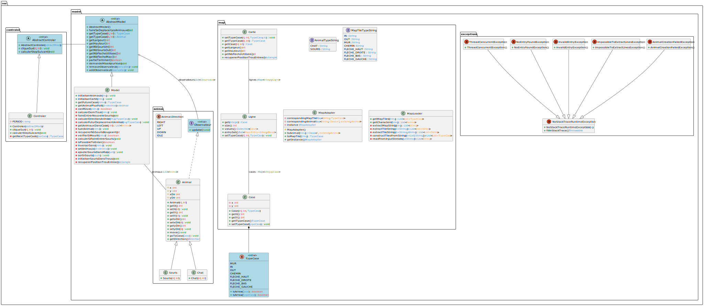

# TP5

# Informations
Nom : REHUA
Prénom : Manuvai

Lien vers le dépôt Github : https://github.com/manuvai/M2_MIAGE_IPM_POO_TP5

# Diagramme de classes

# Fonctionnalités développées
## Chargement de la carte
Le chargement de la carte se fait à travers le fichier contenu dans `src\assets\map.txt`.

| Constante     | Description                          | Charactère |
|---------------|--------------------------------------|------------|
| IN            | Trou d'entrée                        | "I"        |
| OUT           | Sortie                               | "O"        |
| MUR           | Mur                                  | "#"        |
| CHEMIN        | Chemin traversable par les animaux   | "."        |
| FLECHE_HAUT   | Flèche directionnelle vers le haut   | "^"        |
| FLECHE_DROITE | Flèche directionnelle vers la droite | ">"        |
| FLECHE_BAS    | Flèche directionnelle vers le bas    | "<"        |
| FLECHE_GAUCHE | Flèche directionnelle vers la gauche | "v"        |

## Chargement des animaux
## Déplacement des souris
## Timer pour la sortie des souris des trous